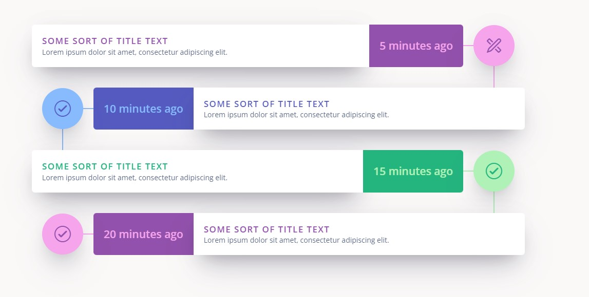

# Oracle APEX Vertical Timeline Plugin

Great timeline plugin with menu

## Installation

Import _template_component_plugin_com_rodrigomesquita_vertical_timeline.sql_ file into your application.

## Usage

1. Create a page item
2. Choose Vertical Timeline[Plugin]\* as an template component type

## Sample Query

```
 select
    'fa-apex' as ICON,
    'TK' as AVATAR_INITIALS,

    'Some sort of Title Text' as TITLE,
    'Lorem ipsum dolor sit amet, consectetur adipiscing elit. ' as DESCRIPTION,
    '5 minutes ago' as EVENT_DATE,
    3 as delay,
    1 as type
from dual
union all
select

    'fa-check-circle-o' as ICON,
    'JK' as AVATAR_INITIALS,
    'Some sort of Title Text' as TITLE,
    'Lorem ipsum dolor sit amet, consectetur adipiscing elit. ' as DESCRIPTION,
    '10 minutes ago' as EVENT_DATE,
     2 as delay,
     2 as type
from dual
union all
select

    'fa-check-circle-o' as ICON,
    'JK' as AVATAR_INITIALS,
    'Some sort of Title Text' as TITLE,
    'Lorem ipsum dolor sit amet, consectetur adipiscing elit. ' as DESCRIPTION,
    '15 minutes ago' as EVENT_DATE,
     2 as delay,
     3 as type
from dual
union all
select

    'fa-check-circle-o' as ICON,
    'JK' as AVATAR_INITIALS,
    'Some sort of Title Text' as TITLE,
    'Lorem ipsum dolor sit amet, consectetur adipiscing elit. ' as DESCRIPTION,
    '20 minutes ago' as EVENT_DATE,
     1 as delay,
     1 as type
from dual


```


## Preview



## Demo

https://apex.oracle.com/pls/apex/r/benjy_dev1/template-component-plugins
